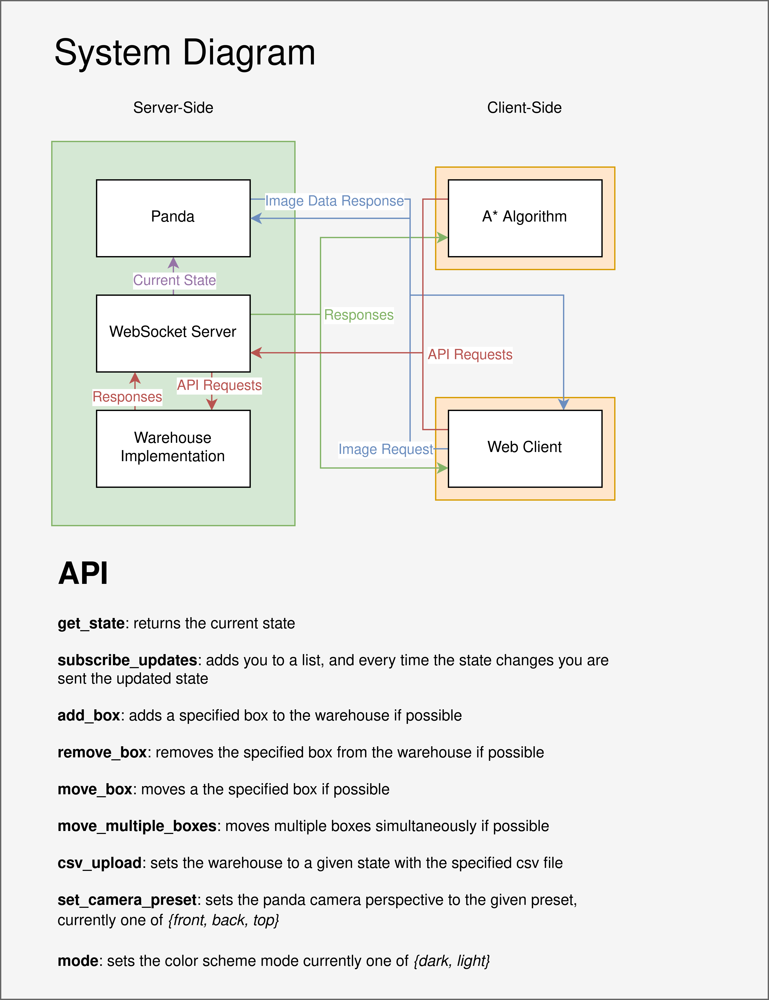

# 2022-RoboSim

<a>
    
     
    
    
    
    
     
     
    
     
</a>

## Table of Contents

- Overview
- System Diagram
- Deployment Instructions
- Usage
- Development Instructions
- Continuous Deployment
- Gantt Chart
- Stakeholders
- User Stories

## Overview

We are working with Toshiba’s Bristol and Innovation Laboratory on a potentially revolutionary material handling ecosystem. The system
will allow movement and storage of goods in a 3D space more efficiently and with minimal infrastructure required, using automated stacking robots.
This will mean any 3D space can be turned into a storage facility without additional resources.

## System Diagram

## Deployment Instructions

First you need a local copy of the repository. You can either:

- A. Clone the repository from the command line which requires authentication via SSH or a Personal Access Token
- B. Download the repository from GitHub as a Zip file and extract the files locally

Once you have the repository on your system there are two options for
deployment:

- A. Run the application on your host machine
- B. Build and run the application in a Docker Container

### Option A: Host machine

Install the dependencies with `pip install -r requirements.txt`.

To start the application run `python start.py`.
To stop the application press `Ctrl-C`.

### Option B: Docker Container

Build the docker image with `docker build -t robosim .`
Run it with `docker run -p 80:80 -p 4000:4000 --detach robosim`
Or optionally with `--mount "type=bind,source=$(pwd)/src,target=/usr/src/app/src"` for local development

## Usage

### Command Line Interface

#### General Commands Structure

Sending instructions on a command line take the following format:

- `python src/cli-client/main.py add_box "boxID" "x" "y" "z"`
  - Adds the box "boxID" to the 3D coordinate (x,y,z)
  - Rules:
    - Boxes can't be added out of bounds
    - Boxes can't be added twice
    - Boxes can't be added in an occupied space
    - Boxes can't be added floating in midair
    - Boxes can't be added with a non-positive boxID
- `python src/cli-client/main.py remove_box "boxID"`
  - Removes the box "boxID"
  - Rules:
    - Boxes can't be removed that don't exist
    - Boxes can't be removed which are supporting others
    - Boxes can't be removed that another box is "climbing" up
- `python src/cli-client/main.py move_box "boxID" "direction"`
  - Moves the box "boxID" in a 3D cardinal direction
  - Rules:
    - Boxes can't be moved that don't exist
    - Boxes can't be moved in a non-3D cardinal direction
    - Boxes can't be moved out of bounds
    - Boxes can't be moved to occupy the same space as another box
    - Boxes can't be moved if they're supporting others
    - Boxes can't be moved from an "unstable" position to another "unstable" position
    - Boxes can't be moved Up without being supported from the sides
    - Boxes can't be moved if another box is "unstable"

#### Jargon

- 3D Cardinal Directions
  - North, East, South, West, Up and Down. When entering on the command line, capitalisation doesn't matter
- Climbing
  - In RoboSim, the boxes move as if they were rolling around. So, in order for a box to move Up or Down, they must be able to climb up an adjacent box, by latching onto one of its edges.

- Unstable
  - In order to facilitate climbing, boxes are restricted to move in any 3D cardinal directions. If a box needs to climb up or down, it'll move into an *unstable* position, where it's not supported underneath. Once in an unstable position, the next action MUST end in the box being supported underneath by either the floor or another box.

Here are some example general commands:

`python src/cli-client/main.py add_box 1 0 0 0`

`python src/cli-client/main.py add_box 2 3 3 0`

`python src/cli-client/main.py add_box 3 3 3 1`

`python src/cli-client/main.py remove_box 1`

`python src/cli-client/main.py move_box 2 north`

`python src/cli-client/main.py move_box 2 Down`

### Web Interface

Go to [localhost](http://localhost)

### Navigator Algorithm

#### Command Line Usage

Sending a request to the Navigator algorithm uses the following format:

- `python src/a_star.py --server "http://localhost:4000/" "boxID" "x" "y" "z"`

This means the Navigator will try and put box "boxID" at the coordinates (x,y,z)

In the Demo's folder, there are various folders with CSV's that can be loaded in, along with a suggested command to run.

#### Calibrating Navigator

In order to calibrate the Navigator's weights, you can run the calibration genetic algorithm by running:

- `pytest src/a_star_client/calibrate.py -s`

If it finds any, it'll return a new set of weights.

#### Benchmarking Navigator

In order to benchmark the Navigator, you can run the benchmarking script by running:

- `python src/benchmark.py [thoroughness value] -s`

This'll perform a number of tests to access how fast and efficient Navigator can pass them. The thoroughness value will determine how many times all these tests are run, to increase accuracy. After it finishes, it'll give you:

_Time taken: (Total Time Taken) 
Average Time: (Average Time Taken) 
Move Score: (Average Moves Taken) 
Thoroughness: (The Thoroughness Value) _

It'll also return two profile outputs: total-time and cumulative-time. If it finds any, it'll return a new set of weights.

#### Limitations

The navigator could struggle if:
- A route would involve moving boxes to form a staircase
- There are many, many boxes in the Warehouse
- The target box is on-top of a tall pillar
- The target coordinate has many boxes surrounding it

## Development Instructions

Clone the repo, checkout a new branch, do some work (fix a bug,
add a feature, add some tests, add documentation etc.) then make a pull request.

If you want to run the continuous integration locally install **pytest**, **black** and
**flake8** (with `pip install <package>`). Run them with `pytest`, `black --check .` and `flake8`
respectively.

## Continuous Deployment

When a Pull Request is merged into the main branch, a GitHub action
SSH's into the Azure Server using Key Authentication and restarts the
`robosim` [SystemD](https://en.wikipedia.org/wiki/Systemd) service.

The service then clones the updated repository, installs any
dependencies, then starts the application.

All secrets such as SSH keys, IP addresses, Port numbers and SSH
usernames are kept hidden/encrypted via GitHub [Secrets](https://docs.github.com/en/actions/security-guides/encrypted-secrets)

## Gantt Chart

[Gantt Chart](https://docs.google.com/spreadsheets/d/17jk70c7Ysqay2RxTJ-WYFc619bPg-nvXDeJa_21MRxU/edit?usp=sharing)

## Stakeholders

### Sentient Stakeholders

- Toshiba

  - They will be selling the system to clients, so the software needs to be presentable, easy to understand and of market standard.

- The general public that buy goods from warehouses with RoboSim

  - They will be needing the products delivered promptly and swiftly, meaning the software must be efficient and fast. The software must also be robust to prevent crashes, which would cause significant delays.
  - They will want the system to carefully manage the products, such that they're not damaged, so the software needs to be careful and precise.

- Warehouse management staff

  - They will be looking into buying multiple robots and the software to maximise their storage space, so they need the system to be intuitive and efficient.

- Delivery personnel

  - In a capacity similar to the general public, they will need the software to quickly present the correct goods at the right time, which requires the software to be efficient and robust.

- Engineers that perform maintenance on the robots
  - They will need the system to present the robots, at certain times, into an arrangement suitable for maintenance checks.
  - They will also want the system to manage the robots safety, so that there are fewer breakages and miscalculations, which would increase their workload and decrease time for upkeep.

### Non-Sentient Stakeholders

- The warehouse

  - It will require more upkeep if the robots move around too much, such that they either wear down the floor or dent the walls. The software needs to minimise travel distance and be precise.

- The products

  - They will need to be transported safely when being shuffled around. The software needs to operate reactively, taking into account the nature of the load being moved, that is whether the load is light and delicate or heavy and robust.

- The Robots
  - They will need to rely on the software to not damage themselves through unsafe manoeuvres or incorrect instructions. The software must judge clearance around each box carefully and remove any risky decisions, such as stacking too high, moving with a high stack on top, and moving on-top of many stacked robots.

## User Stories

- Warehouse Manager

  - As a warehouse manager, I want to manage the goods in the warehouse, so that automated stacking robots can quickly find the ideal good and place it in a courier package, minimising the cost of worker salaries.

- Manager of a courier company

  - As a Manager of a courier company, I want to assemble express packages quickly and accurately, so that workers can be replaced by automated stacking robots.

- Manager of a food and medicine factory
  - As a Manager of a food and medicine factory, I want food or medicine not to be contaminated or damaged, so that automated stacking robots can replace workers who may make mistakes and cause losses.

