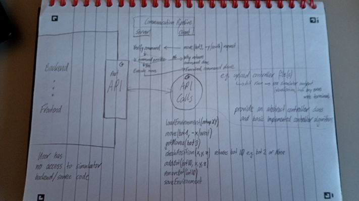

<strong><u>Minutes of the Client Meeting held Thursday 27th October 2022</u></strong>

Present: Oliver, James, Yuming, Zheng and the client, Marius

<ul>
	<li>Some Questions from us about some of the Requirements</li>
	<ul>
		<li>Panda3D can only be run locally</li>
		<ul>
			<li>The client wants to stream the Panda3D local simulation onto a web frontend</li>
		</ul>
		<li>We're currently envisioning using Three.js for the web frontend. Is that okay?</li>
		<ul>
			<li>The client wants us to try to stream Panda3D local simulation onto a web frontend first</li>
		</ul>
		<li>Other</li>
		<ul>
			<li>The client pointed out that you couldn't interact with the elements of the stream directly, so I'd have to be controlled using another interface that interacts with the stream</li>
		</ul>
	</ul>
	<li>Demo of our current version 0.0.1</li>
	<ul>
		<li>The demo went very well with nothing going wrong!</li>
		<li>The client liked it, and would like us to continue using Panda3D</li>
	</ul>
	<li>Feedback on the demo from the client</li>
	<ul>
		<li>It needs a better model and texture for the boxes, as they are currently cubes with a weird rainbow texture</li>
		<li>The boxes should slide rather than teleport to their location (we ignore rotating for now)</li>
		<li>Moving the simulation into a 3D environment, but ignore gravity (the boxes float, so they don't need support from below)</li>
		<li>It needs a method of easy camera movement, such as using a joystick</li>
		<li>It needs a way of directly influencing the simulation, without using the command line (like buttons, drop-down menu, etc.)</li>
		<li>Introduce the stacking logic, so boxes need support from boxes underneath them</li>
		<li>The client has not yet requested any algorithm implementation</li>
	</ul>
	<li>Anything else the client raised</li>
	<ul>
		<li>The client wants access to the code on GitHub repo &ndash; main branch?</li>
		<li>The client would like to do some deployment testing down the line</li>
		<li>The client seems to be leaning towards AWS servers, but is okay with starting on the IBM servers</li>
	</ul>
	<li>Overall client view</li>
	<ul>
		<li>The client seemed very happy with the work we've done so far!</li>
	</ul>
</ul>
    

<strong><u>Minutes of the Client Meeting held Thursday 17th November 2022</u></strong>

Present: Oliver, James, Yuming, Zheng and the client, Marius

<ul>
	<li>Feedback on the demo from the client</li>
	<ul>
		<li>The client suggested a dropdown menu for the box choice</li>
		<li>The client also suggested a system for fetching the box ID of a box by clicking on it</li>
		<li>The client wasn't bothered by the low framerate of the stream</li>
		<li>The client wanted a camera movement system, using a joystick or different perspectives</li>
	</ul>
	<li>Anything else the client raised</li>
	<!--suppress GrazieInspection -->
<ul>
		<li>The client wanted to make sure multiple boxes are movable at the same time such that:</li>
		<ul>
			<li>Boxes don't "crash" into the same square</li>
			<li>Boxes queued behind each other can move together properly, so the box at the "front" moves first, then all the boxes behind it</li>
		</ul>
		<li>The ability to move boxes to target coordinates, rather than a cardinal direction</li>
		<li>Loading a simulation from a start-up csv file</li>
		<li>Gravity should be implemented (make sure boxes cannot be in midair)</li>
		<ul>
			<li>Commands for moving on-top of another next to it? Maybe some sort of button that appears when it's possible</li>
			<li>A ghost image could appear of all moves, and you click on the right one</li>
		</ul>
		<li>Some way to visualise bounds of the warehouse, a floor, probably a ceiling, and either:</li>
		<ul>
			<li>A line on the floor that represents the walls</li>
			<li>Walls that are not exceedingly high (less than a box)</li>
			<li>Walls that are quite high, but are not rendered when in-between the camera and the inside</li>
		</ul>
		<li>The software should be deployable on a server (maybe using containers)</li>
		<li>The client wants access to the repo (<a href="https://github.com/MariusJurt">https://github.com/MariusJurt</a>)(<a href="mailto:marius.jurt@toshiba-bril.com">marius.jurt@toshiba-bril.com</a>)</li>
		<li>Make sure any systems we implement are very dependable and user-friendly</li>
		<li>Client understands the limitations of the "streaming", opposed to Threejs, but is content with continuing with this approach for now</li>
	</ul>
	<li>Overall client view</li>
	<ul>
		<li> Client is "super impressed!"</li>
	</ul>
</ul>
    

<strong><u>Minutes of the Client Meeting held Thursday 8th December 2022</u></strong>

Present: Oliver, James, Yuming, Zheng and the client, Marius

<ul>
	<li>Feedback on the demo
		<ul>
			<li>Perspectives
				<ul>
					<li>The client said it was "An excellent start".</li>
					<li>The client requested a joystick as the next steps, using the buttons to reset the perspective.</li>
				</ul>
			</li>
			<li>Command line display
				<ul>
					<li>The client requested:
						<ul>
							<li>Smaller font</li>
							<li>Clear lines between outputs (numbering)</li>
							<li>Colour coordinate to show correct and incorrect commands.</li>
						</ul>
					</li>
				</ul>
			</li>
			<li>Framerate
				<ul>
					<li>The client seems happy with the current framerate on the local machine</li>
				</ul>
			</li>
		</ul>
	</li>
	<li>Client priorities
		<ul>
			<li>Checking extreme values, such as adding many boxes, large warehouse size</li>
			<li>Rigorous testing
				<ul>
					<li>Random moves to test robustness.</li>
					<li>Moves sent very quickly in succession.</li>
					<li>Both frontend and backend</li>
				</ul>
			</li>
			<li>Deployment in the cloud</li>
			<li>Being able to write in the command line on the website.</li>
			<li>Being able to send commands on the command line to a server.</li>
		</ul>
	</li>
</ul>
    

<strong><u>Minutes of the Client Meeting held Friday 10th February 2023</u></strong>

Present: Oliver, James, Yuming, Zheng and the client, Marius

Time: 1pm - 2pm

Location: Teams Meeting Online

<ul>
    <li>Feedback on the demo<ul>
            <li>The client is happy with current progression.</li>
            <li>The client said there is no need to animate the box movement.</li>
        </ul>
    </li>
    <li>Client priorities<ul>
            <li>High priority:<ul>
                    <li>Finish multi-box moving algorithm (which Oliver showed at the end after fixing a bug).</li>
                    <li>Implement reading and writing to a CSV file.</li>
                    <li>Initialise a system diagram.</li>
                    <li>Change the API to:<ul>
                            <li>Be able to send the following API calls:<ul>
                                    <li>loadEnvironment (to be implemented)</li>
                                    <li>saveEnvironment (to be implemented)</li>
                                    <li>moveBox (configurable)</li>
                                    <li>getMoves (to be implemented)</li>
                                    <li>checkPosition (configurable)</li>
                                    <li>addBox (configurable)</li>
                                    <li>removeBox (configurable)</li>
                                </ul>
                            </li>
                            <li>Create an abstract controller class.</li>
                            <li>Create a communication pipeline to verify commands.</li>
                        </ul>
                    </li>
                    <li>See the below API diagram for more details.</li>
                </ul>
        </ul>
    </li>
</ul>

<ul>
    <ul>
        <li>Lower priority:<ul>
                <li>Add a sky box texture.</li>
                <li>Change the floor texture to not be a squashed box.</li>
                <li>Find a process for performing box commands in parallel.</li>
                <li>Fix the fps bug.</li>
            </ul>
        </li>
    </ul>
</ul>
   

<strong><u>Minutes of the Client Meeting held Friday 3rd March</u></strong>

Present: Oliver, James, Yuming, Zheng and the client, Marius

<ul>
	<li>Feedback on the demo from the client:</li>
	<ul>
		<li>The client is happy that the flickering has been cured.</li>
		<li>The client is happy with the edge cases implementation.</li>
		<li>The client liked the benchmark testing for the algorithm.</li>
	</ul>
	<li>Changes requested:</li>
	<ul>
		<li>Algorithm</li>
		<ul>
			<li>The algorithm should end with boxes in a stable position.</li>
			<li>Try and make the algorithm faster in general.</li>
			<li>Try to compute a method for moves to be able to be executed in parallel (like a linked list)?</li>
			<li>Write a function to generate available moves.</li>
			<li>Create a ranking leader board that measures performance of different algorithms, using benchmark.py</li>
		</ul>
		<li>General feedback</li>
		<ul>
			<li>Bugs</li>
			<ul>
				<li>The box dropdown menu should stay on the selected box, rather than flick to the top of the list every time you do a command.</li>
				<li>The wall texture is quite pixelated due to an unknown reason.</li>
				<li>The dark mode setting is currently broken.</li>
			</ul>
			<li>Implement the download CSV on the frontend.</li>
			<li>Only undraw and draw any boxes that change state, rather than redrawing everything</li>
			<li>A priority queue for users, such that some users can "lock" the program while they perform a procedure</li>
			<li>The joystick should only be implemented if someone is really confident they can add it easily</li>
			<li>Create an API so that multiple boxes can be moved at the same time, if they don't conflict with each other</li>
			<li>Add more really rigorous edge case testing</li>
		</ul>
	</ul>
	<li>Client feedback - "Really, really cool!"</li>
</ul>